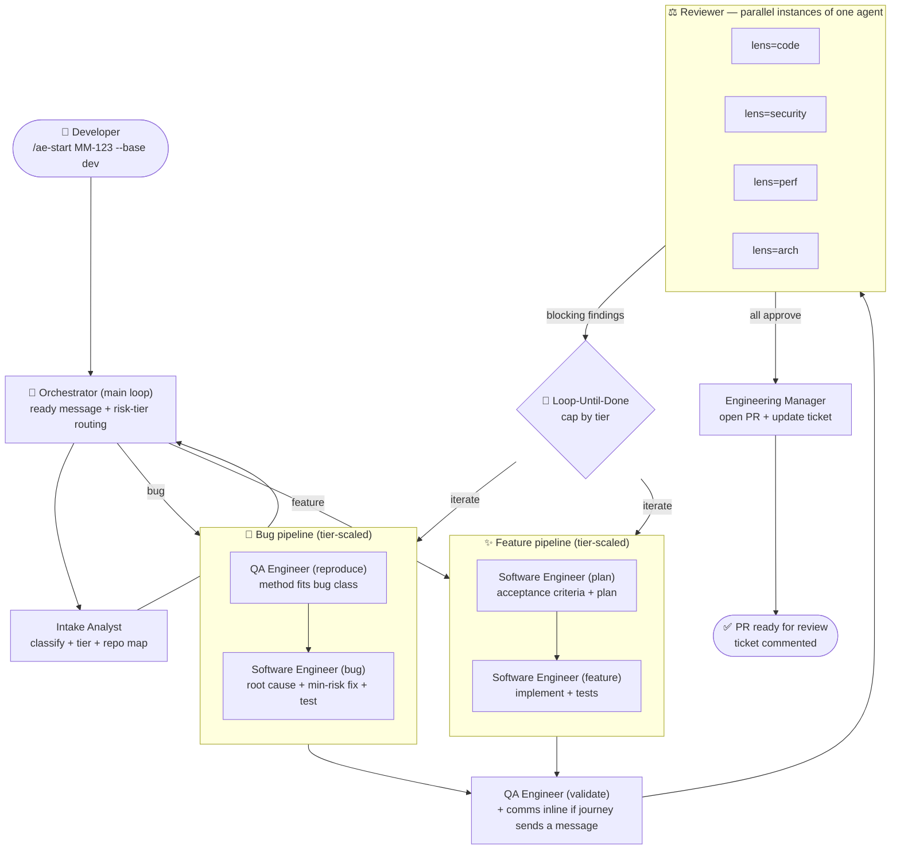

# Autonomous Engineer

> An autonomous software engineering team that lives inside Claude Code.

[](LICENSE)
[](https://claude.com/claude-code)
[](#)

Drop a ticket ID — or just describe the bug. Get a Pull Request.

```bash
/ae-start MM-123 --base develop      # with a ticket ID
/ae-start                            # bare — it asks what to work on
```

Behind that one command, an **Orchestrator** running in the main session loop coordinates five specialist subagents — Intake Analyst, Software Engineer, QA Engineer, a lens-parameterized Reviewer, and Engineering Manager. It reads the ticket, classifies it, assigns a **risk tier**, then runs only as much pipeline as the risk warrants: reproduce or plan, implement, validate with the right evidence method, review through the necessary lenses, loop until clean, open a Pull Request, and update the ticket.

No separate orchestrator runtime. No parallel AI framework. Just Claude Code's native primitives — subagents, slash commands, skills, MCP servers — composed into a senior engineering organization.

---

## What it does

When you run `/ae-start <id>`, the main session loads the `orchestration` skill and **becomes the Orchestrator**:

1. **Fetches the ticket** via the configured MCP (Jira / ClickUp / GitHub Issues).
2. **Runs the Intake Analyst** — classification, **risk tier**, and repo map in one pass.
3. **Posts a ready message** — understanding, classification, tier, specialists, workflow, plan (with estimated agent-call count), risks, confidence — and pauses for confirmation. No silent changes.
4. **Routes by tier:**
   - **T0 Trivial** — engineer → one `code` reviewer → PR (~3 calls).
   - **T1 Standard** — engineer → QA validate → two reviewer lenses → loop(≤2) → PR (~6 calls).
   - **T2 High-risk** (auth / payments / persistence / migrations / upload / external API / production incident) — reproduce → engineer (Generate-and-Filter, optional Adversarial) → QA validate → all four reviewer lenses → loop(≤3) → PR (~10+ calls).
5. **Validates with the right method** — browser, API, data, build, or timing — the gate is *evidence*, not *Playwright specifically*.
6. **Runs the reviewer lenses in parallel** — independent instances of one `reviewer` agent.
7. **Loops** until lenses approve and validation passes, capped per tier, then escalates.
8. **Opens a Pull Request** (never merges) and **updates the ticket**.

---

## Architecture



The Orchestrator is the only node that delegates, and it is the **main loop** — not a subagent — so it can reliably spawn the specialists. Workflow patterns (Classify-and-Act, Fanout-and-Synthesize, Adversarial Verification, Generate-and-Filter, Tournament, Loop-Until-Done) are composed per tier, never all by default.

---

## Quickstart

### A. Plugin install (recommended, from inside Claude Code)

```bash
/plugin install https://github.com/Holuwashina/autonomous-engineer.git
```

### B. Remote bootstrap (one-line shell)

```bash
curl -fsSL https://raw.githubusercontent.com/Holuwashina/autonomous-engineer/main/bootstrap.sh | sh
```

### C. Manual clone + install

```bash
git clone https://github.com/Holuwashina/autonomous-engineer.git ~/autonomous-engineer
sh ~/autonomous-engineer/install.sh --global
```

### Then, in any project where you'll run `/ae-start` — one command

In your **terminal**, from the project AE should work on:

```bash
sh /path/to/autonomous-engineer/setup.sh
```

That installs the commands/agents/skills project-locally (no `~/.claude` writes),
installs the safety git hooks, and creates the `dev` base branch — idempotent, safe
to re-run. Then **open Claude Code in that folder** and finish config:

```
/ae-setup        ← run this INSIDE Claude Code, not in the terminal
```

`/ae-setup` walks you through QA resources and MCP servers, then you're ready:

```
/ae-start MM-123 --base dev      ← also inside Claude Code
```

> The one rule that trips everyone once: **slash commands (`/ae-setup`, `/ae-start`,
> `/ae-selfcheck`) run inside the Claude Code session; `sh …` and `git …` run in the
> terminal.** Full per-provider MCP commands and troubleshooting in
> **[SETUP.md](SETUP.md)**.

---

## Configure

1. **Expose repositories.** The CWD is already in scope. `/add-dir <path>` for additional repos; the Intake Analyst surveys all of them.
2. **Configure resources.** `cp .ae/resources.yaml.example .ae/resources.yaml`, then edit. Environments, tenants, accounts (with passwords), communications, external services — all inline. The live file is gitignored.
3. **Add MCP servers.** Run `/ae-setup` or read the `mcp-setup` skill. Typical: a ticket source (Jira / ClickUp / GitHub Issues) · GitHub (code host + PR) · Playwright · Mailtrap (optional email validation).

---

## Commands reference

| Command | Argument hint | What it does |
|---|---|---|
| `/ae-start` | `[<id or description>] [--base <branch>] [--as bug\|feature]` | Primary entrypoint — end-to-end: intake → tier-routed pipeline → review → PR. Run it **bare and it asks** for the ticket ID or a description; `--as` forces classification |
| `/ae-review` | `[--scope code\|security\|perf\|arch\|full]` | Run reviewer lenses on the current diff |
| `/ae-qa` | `[--journey <name>]` | Run the QA Engineer on the current change |
| `/ae-pr` | `[--draft] [--base <branch>]` | Engineering Manager opens the PR |
| `/ae-status` | `[--log] [<id>] [--follow]` | Report state of the active run; `--log` surfaces the raw audit trail |
| `/ae-resume` | `[<id>]` | Resume an interrupted run |
| `/ae-setup` | _(none)_ | Interactive configuration walkthrough |
| `/ae-selfcheck` | `[security\|bug\|feature\|all]` | Run the golden-ticket eval against the bundled fixture and score it |

All commands are namespaced `ae-` so they don't collide with Claude Code's built-in slash commands (`/review`, `/status`, `/bug`, …). Forcing a classification and reading run logs are flags on `/ae-start` and `/ae-status`, not separate commands.

---

## Specialists

The main-loop Orchestrator coordinates five leaf specialists:

| Agent | Role |
|---|---|
| `intake-analyst` | Classifies the ticket, assigns the risk tier, maps repos + blast radius — one pass |
| `software-engineer` | Modes `plan` / `bug` / `feature` — plans features, implements fixes and features with tests |
| `qa-engineer` | Modes `reproduce` / `validate` — selects its own env, method-flexible evidence, comms inline; never edits code |
| `reviewer` | One agent, lens `code` / `security` / `perf` / `arch`; spawned as independent parallel instances |
| `engineering-manager` | Opens the PR (never merges) and updates the ticket |

Independence in review comes from running separate instances of `reviewer`, not from separate files.

---

## Workflow patterns

The Orchestrator composes these per tier — most runs use two or three, never all six.

| # | Pattern | When |
|---|---|---|
| 1 | Classify-and-Act | Simple, well-scoped (T0) |
| 2 | Fanout-and-Synthesize | Independent streams must complete before synthesis (multi-repo) |
| 3 | Adversarial Verification | A finding is plausible but suspicious (T2 root cause) |
| 4 | Generate-and-Filter | ≥2 safe solutions; pick lowest-risk |
| 5 | Tournament | Multiple reviewer lenses on the same diff |
| 6 | Loop-Until-Done | Default close-out — implement → validate → review → iterate |

Detail: [`skills/workflow-patterns/SKILL.md`](skills/workflow-patterns/SKILL.md) and [`skills/orchestration/SKILL.md`](skills/orchestration/SKILL.md).

---

## Memory

The `reviewer` and `qa-engineer` agents declare `memory: project` — each gets a persistent `.claude/agent-memory/<agent>/` directory in the host project (loaded at spawn, tracked in version control) so accumulated knowledge — recurring N+1 patterns, project auth quirks, flaky journeys — survives across runs. Browse and edit with `/memory`.

---

## What it deliberately won't do

- Merge a PR — opens it, you merge
- Push to a protected branch
- Skip the security reviewer lens on T2 (auth / payments / persistence / trust-boundary) code
- Loop forever — the per-tier cap triggers escalation
- Poll an inbox for a journey that doesn't send a message
- Fix on assumption — every bug is reproduced with evidence first
- Run hidden work — every specialist run is surfaced and logged

The "never push to a protected branch" and "never rewrite shared history" rules
are not prompt-only — they're enforced by git hooks (`hooks/`, installed via
`/ae-setup` or `hooks/install-safety-hooks.sh`). See [`hooks/README.md`](hooks/README.md).

---

## Philosophy

Autonomous Engineer is **not a framework**. It's a configuration of Claude Code's native primitives: the Orchestrator is the main loop, subagents carry specialist roles, slash commands are entrypoints, skills encode conventions and the workflow patterns, MCP servers provide ticket systems / browsers / communication sinks, and CWD + `/add-dir` is how repositories enter scope. The whole system is a directory of markdown files plus one shell script.

Design principle: **quality comes from independent perspectives and evidence, not headcount.** The design keeps every review lens and every evidence gate, but stops paying for them on tickets that don't need them. See [`ARCHITECTURE.md`](ARCHITECTURE.md) and [`CHANGELOG.md`](CHANGELOG.md).

---

## License

MIT. See [`LICENSE`](LICENSE). Built on [Claude Code](https://claude.com/claude-code).
