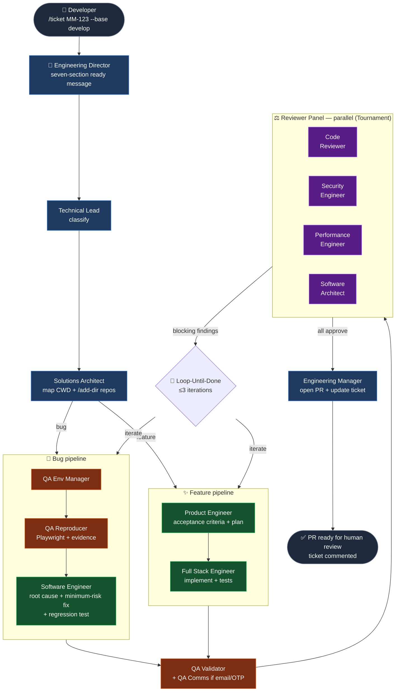

# Autonomous Engineer

> An autonomous software engineering team that lives inside Claude Code.

[](LICENSE)
[](https://claude.com/claude-code)
[](#)

Drop a ticket ID. Get a Pull Request.

```bash
/ticket MM-123 --base develop
```

Behind that one command, a coordinated team of 15 specialist subagents — Engineering Director, Technical Lead, QA Reproducer, Software Engineer, security / perf / architecture reviewers, Engineering Manager — read the ticket, classify it, reproduce the bug or plan the feature, implement it, validate with Playwright, run a four-reviewer panel, iterate until clean, then open a Pull Request and update the originating ticket.

No separate orchestrator. No parallel AI runtime. Just Claude Code's native primitives — subagents, slash commands, skills, MCP servers — composed into a senior engineering organization.

---

## Table of contents

- [What it does](#what-it-does)
- [Architecture](#architecture)
- [Quickstart](#quickstart)
- [Install](#install)
- [Configure](#configure)
- [Use](#use)
- [Commands reference](#commands-reference)
- [Specialists](#specialists)
- [Workflow patterns](#workflow-patterns)
- [What it deliberately won't do](#what-it-deliberately-wont-do)
- [Philosophy](#philosophy)
- [License](#license)

---

## What it does

When you run `/ticket <id>`, the Engineering Director:

1. **Fetches the ticket** via the configured MCP (Jira / ClickUp / GitHub Issues).
2. **Posts a seven-section ready message** — understanding, classification, specialists, workflow, plan, risks, confidence — and pauses for your confirmation. No silent code changes.
3. **Classifies** the work as bug / feature / enhancement / refactor / investigation (Technical Lead).
4. **Maps the affected repositories** across your CWD + `/add-dir`'d directories (Solutions Architect).
5. **Branches to the appropriate pipeline:**
   - **Bug:** environment selection → Playwright reproduction → root-cause + Generate-and-Filter fixes → implementation with regression test.
   - **Feature:** acceptance criteria → ordered plan → end-to-end implementation with tests.
6. **Validates** via Playwright (QA Validator); polls maildrop / Mailtrap **only if the journey involves email**.
7. **Runs the reviewer panel** — code, security, performance, architecture — in parallel.
8. **Loops** until all reviewers approve and the validator passes, capped at 3 iterations (then escalates).
9. **Opens a Pull Request** with a structured body — summary, ticket link, acceptance criteria checklist, reviewer verdicts, test plan for the human reviewer, follow-ups (Engineering Manager).
10. **Updates the ticket** with the PR link and evidence summary.

---

## Architecture



The Director is the only agent that delegates. Every other specialist runs scoped work, returns structured output, and the Director synthesizes. Workflow patterns (Classify-and-Act, Fanout-and-Synthesize, Adversarial Verification, Generate-and-Filter, Tournament, Loop-Until-Done) are composed per ticket — never run by default.

---

## Quickstart

```bash
# 1. Clone
git clone https://github.com/Holuwashina/autonomous-engineer.git ~/autonomous-engineer

# 2a. Install GLOBALLY (available in every Claude Code session)
sh ~/autonomous-engineer/install.sh --global

# 2b. AND/OR install per project (adds CLAUDE.md + resources.yaml.example)
cd ~/your-project
sh ~/autonomous-engineer/install.sh

# 3. Configure resources (per project)
cp .cceo/resources.yaml.example .cceo/resources.yaml
$EDITOR .cceo/resources.yaml

# 4. Wire up MCP servers (one-time)
claude mcp add jira ...           # see SETUP.md for full commands
claude mcp add github ...
claude mcp add playwright ...

# 5. Use it
/ticket MM-123 --base develop
```

Full step-by-step in **[SETUP.md](SETUP.md)**.

---

## Install

Two modes — pick one, or use both.

### Project mode (default)

Scopes CCEO to a single project. Best when you want it only for this codebase.

```bash
git clone https://github.com/Holuwashina/autonomous-engineer.git
cd <your-project>
sh /path/to/autonomous-engineer/install.sh
```

Installs to:
- `<project>/.claude/agents/cceo-*.md`
- `<project>/.claude/commands/*.md`
- `<project>/.claude/skills/cceo-*/SKILL.md`
- `<project>/CLAUDE.md`
- `<project>/.cceo/resources.yaml.example`

### Global mode

Makes CCEO available in **every** Claude Code session, regardless of working directory.

```bash
sh /path/to/autonomous-engineer/install.sh --global
```

Installs to:
- `~/.claude/agents/cceo-*.md`
- `~/.claude/commands/*.md`
- `~/.claude/skills/cceo-*/SKILL.md`

No `CLAUDE.md` or `resources.yaml.example` are written — those stay per-project. You can still run the project-mode install in any specific project to drop in those files without re-installing the global agents.

### Both

The mixed pattern: install agents/commands/skills once globally, then add the per-project CLAUDE.md + resources.yaml.example only where you actually want CCEO to drive work.

```bash
sh /path/to/autonomous-engineer/install.sh --global     # once
cd ~/project-a && sh /path/to/autonomous-engineer/install.sh  # per project
cd ~/project-b && sh /path/to/autonomous-engineer/install.sh  # per project
```

### Flags

| Flag | Effect |
|---|---|
| `--global` | Install into `~/.claude/` instead of a project. |
| `--force` | Overwrite an existing CCEO install in the target. |
| `--help` | Print usage. |

If the target project already has a `CLAUDE.md`, the installer writes ours to `CLAUDE.cceo.md` for manual merge.

### What does NOT get installed

- `.mcp.json` — you add MCP servers under your own credentials via `claude mcp add`
- `.cceo/resources.yaml` — copy the `.example` and edit; the live file is gitignored

---

## Configure

See **[SETUP.md](SETUP.md)** for the full walkthrough. The short version:

1. **Expose repositories.** Claude Code's current working directory is already in scope. For additional repos, run `/add-dir <path>` for each one (frontend, backend, shared libs, infra). The Solutions Architect surveys all of them.
2. **Configure resources.** `cp .cceo/resources.yaml.example .cceo/resources.yaml`, then edit. Environments, tenants, accounts (with passwords), communications, external services. All inline. The live file is gitignored.
3. **Add MCP servers.** Run `/setup` and follow the prompts, or read the `cceo-mcp-setup` skill. Typical set: Jira / ClickUp / GitHub Issues (ticket source) · GitHub (code host + PR) · Playwright (browser automation) · Mailtrap or Maildrop (email validation, optional).
4. **Confirm.** `/setup` walks you through verification.

---

## Use

```bash
/ticket <ticket-id> [--base <branch>]
```

Example:

```bash
/ticket MM-123 --base develop
```

The Engineering Director will reply with a seven-section ready message and pause for your confirmation. You can redirect, refine, or proceed. Work only begins once you've agreed.

### Commands reference

| Command | Argument hint | What it does |
|---|---|---|
| `/ticket` | `<id> [--base <branch>]` | End-to-end: classification → implementation → review → PR |
| `/bug` | `<id> [--base <branch>]` | Force bug workflow |
| `/feature` | `<id> [--base <branch>]` | Force feature workflow |
| `/review` | `[--scope code\|security\|perf\|arch\|full]` | Run the reviewer panel on the current diff |
| `/qa` | `[--journey <name>]` | Run QA Validator (+ Comms if relevant) on the current change |
| `/pr` | `[--draft] [--base <branch>]` | Engineering Manager prepares + opens the PR |
| `/status` | _(none)_ | Report current state of the active ticket run |
| `/resume` | `[<id>]` | Resume an interrupted run |
| `/setup` | _(none)_ | Interactive configuration walkthrough |

---

## Specialists

15 named subagents, each with a tight scope:

| Tier | Agent | Role |
|---|---|---|
| Coordinator | `cceo-engineering-director` | Owns every run; delegates, synthesises, declares completion |
| Intake | `cceo-technical-lead` | Classifies the ticket |
| Intake | `cceo-solutions-architect` | Maps affected repos + blast radius |
| QA | `cceo-qa-env-manager` | Picks environment / tenant / account from `resources.yaml` |
| QA | `cceo-qa-reproducer` | Playwright reproduction of bugs |
| QA | `cceo-qa-validator` | Playwright validation of fixes / features |
| QA | `cceo-qa-comms` | Email / OTP / magic-link validation (opt-in) |
| Build | `cceo-software-engineer` | Bug root-cause + fix + regression test |
| Build | `cceo-product-engineer` | Feature acceptance criteria + plan |
| Build | `cceo-fullstack-engineer` | Feature implementation |
| Review | `cceo-code-reviewer` | Staff-level diff review |
| Review | `cceo-security-engineer` | OWASP / authz / data exposure (mandatory for auth/payments) |
| Review | `cceo-performance-engineer` | Hot paths, N+1, payload, bundle |
| Review | `cceo-software-architect` | Boundaries, contracts, abstraction quality |
| Close-out | `cceo-engineering-manager` | PR preparation + ticket update |

---

## Workflow patterns

The Director composes these — most runs use two or three. Never all six.

| # | Pattern | When |
|---|---|---|
| 1 | Classify-and-Act | Simple, well-scoped requests |
| 2 | Fanout-and-Synthesize | Multiple specialists must complete independently before synthesis |
| 3 | Adversarial Verification | A finding is plausible but suspicious |
| 4 | Generate-and-Filter | ≥2 safe solutions exist; pick lowest-risk |
| 5 | Tournament | Multiple reviewers on the same artefact (the reviewer panel is one) |
| 6 | Loop-Until-Done | Default close-out — implement → validate → review → iterate |

Detail: [`.claude/skills/cceo-workflow-patterns/SKILL.md`](.claude/skills/cceo-workflow-patterns/SKILL.md).

---

## What it deliberately won't do

- Merge a PR — opens it, you merge
- Push to a protected branch
- Auto-close or auto-transition a ticket without explicit project config
- Skip the security reviewer on auth / payments / persistence / trust-boundary code
- Loop forever — 3 iterations without convergence triggers escalation
- Poll maildrop / Mailtrap for a bug or feature that has nothing to do with email
- Invent credentials, environments, or repos it can't see
- Run hidden work — every specialist run is reported back through the Director

---

## Philosophy

Autonomous Engineer is **not a framework**. It's a configuration of Claude Code that uses its native primitives:

- **Subagents** carry specialist roles
- **Slash commands** are entrypoints
- **Skills** encode reusable team conventions and workflow patterns
- **MCP servers** provide ticket systems, browser automation, communication sinks
- **CWD + `/add-dir`** is how repositories enter scope

No custom orchestrator. No parallel AI runtime. No hidden state. The whole system is a directory of markdown files plus one shell script.

Iron rules (full set in [`CLAUDE.md`](CLAUDE.md)):

1. **Explain before acting.** Every run starts with a seven-section ready message.
2. **Never perform hidden work.** Every specialist run is surfaced.
3. **Use evidence, not assumption.** Bug claims need reproduction; fix claims need passing validation.
4. **Escalate on low confidence.** When the loop can't converge, stop and ask the user.
5. **Match scope to request.** A user approving one action authorizes only that action — not a category.

---

## License

MIT. See [`LICENSE`](LICENSE).

Built on [Claude Code](https://claude.com/claude-code).
